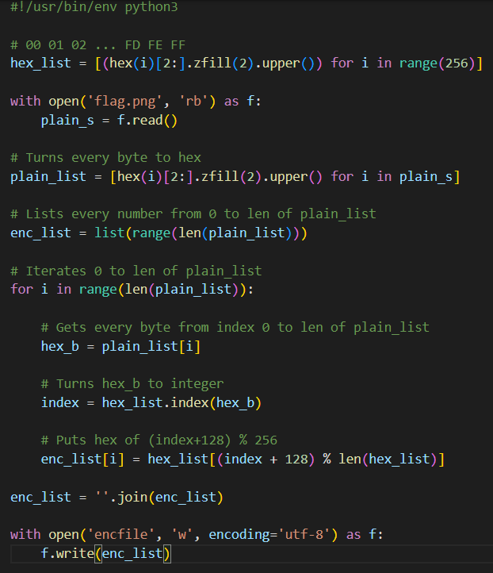
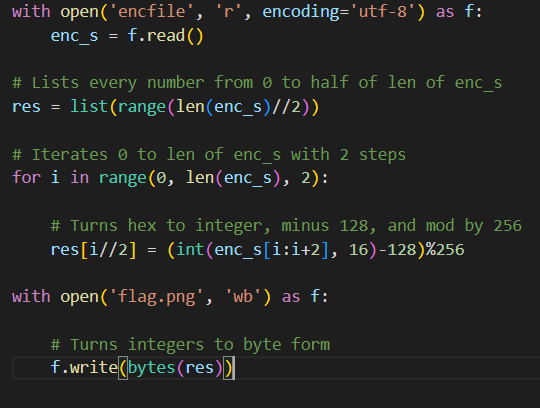
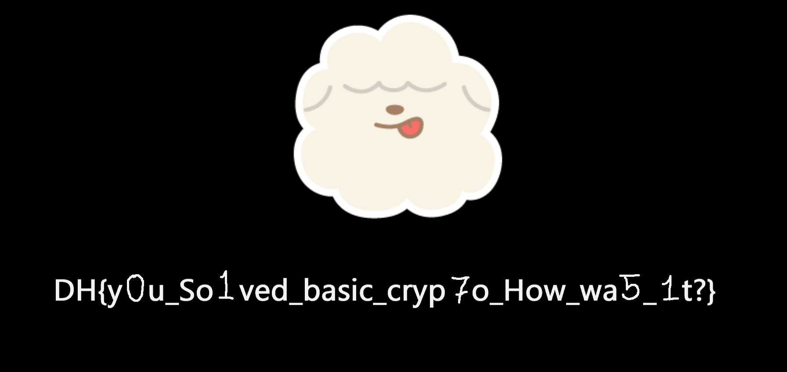

- Pertama, kita perlu memahami apa yang dilakukan oleh berkas `rot128.py`  

- Setelah memahami, kita hanya perlu me-reverse logic dari berkas tersebut  

- Terakhir, akses berkas .png yang terbuat dan dapatkan flagnya  
