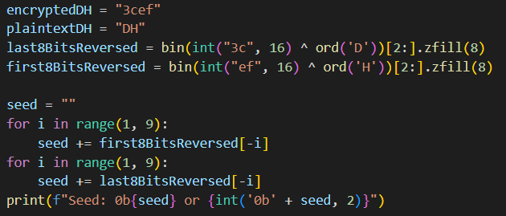
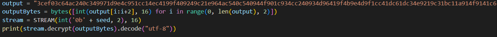

1. Kita bisa mendapatkan seed dari 2 bytes pertama flag, yaitu "DH" dengan cara berikut
 
2. Selanjutnya, kita bisa menggunakan method `decrypt()` pada class `STREAM` pada berkas `cipher.py` untuk mendapatkan flagnya
 