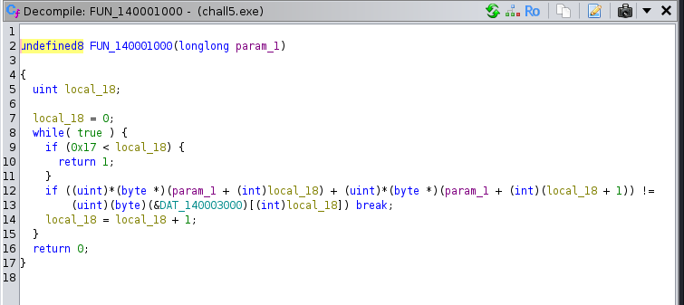
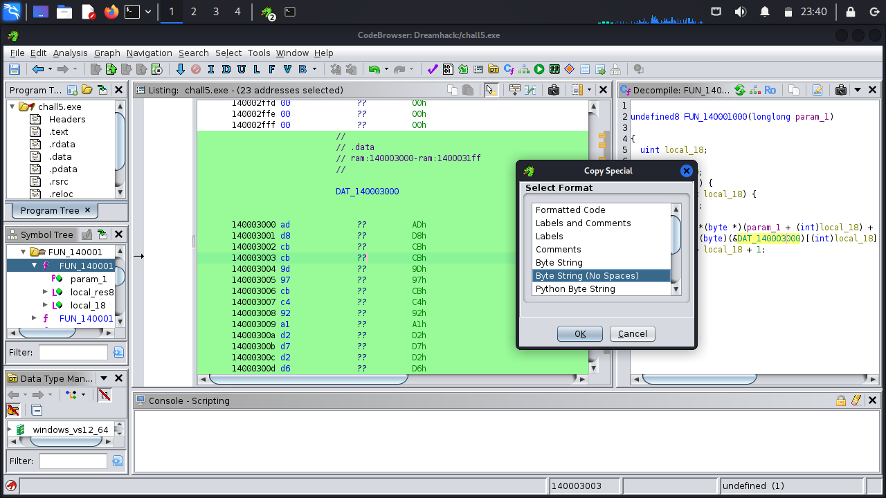
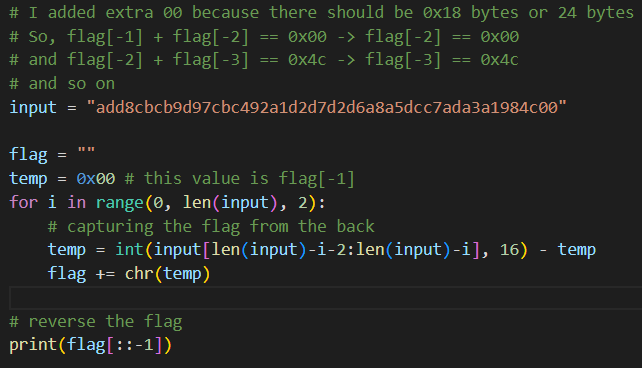

1. Decompile `chall5.exe` menggunakan ghidra
 
2. Cari nilai `DAT_140003000` dengan cara klik 2 kali. Copy bytenya dan taruh di tempat lain.
 
4. Reverse kode dari program yang telah di-decompile dan dapatkan flagnya
 