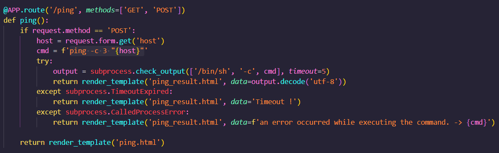
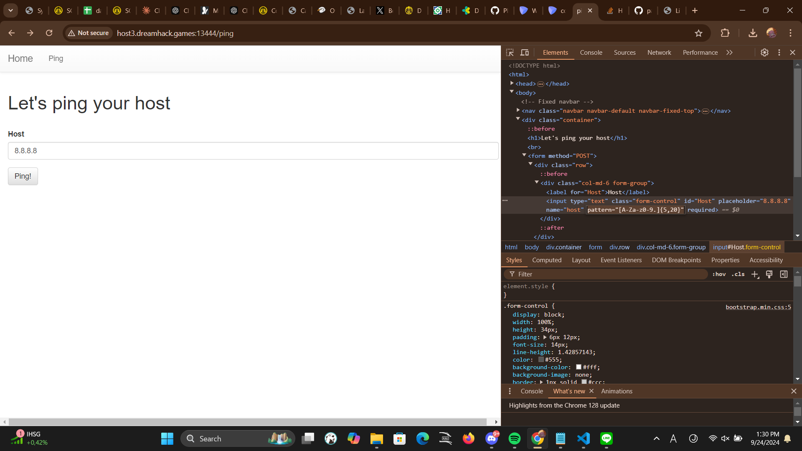
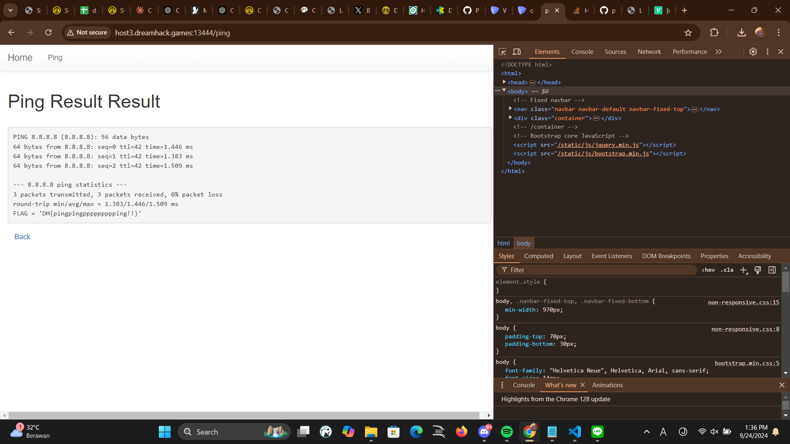

- program langsung execute command yang diinput despite bisa aja jadi one line command dari habis ping

- terdapat filter tapi di client side, jadi bisa diremove aja

- bisa pakai input 8.8.8.8";cat "flag.py, agar diexecute ping -c 3 "8.8.8.8";cat "flag.py"
