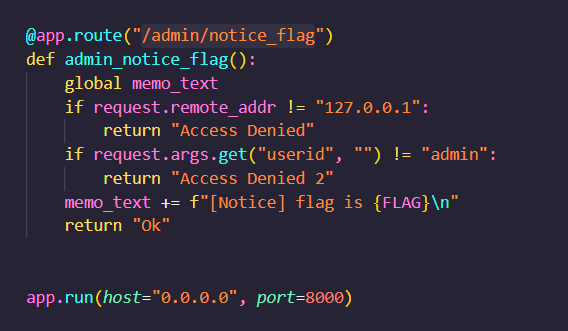
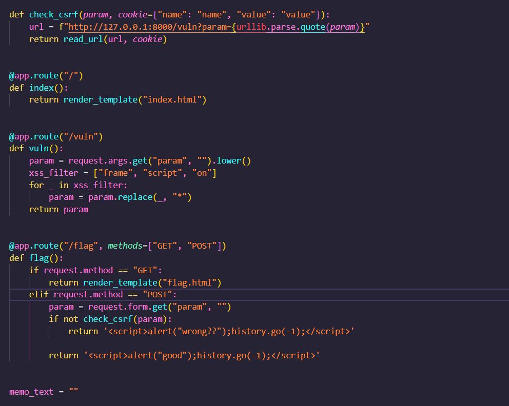

1. maunya kalo address 127.0.0.1 sama userid admin, berarti gabisa kita execute akses url situ dari mesinnya sini. kalo dapet userid admin, flag bakal diappend ke variabel global memo-text

2. onload yang dipake di xss-2 gabisa dipake, karena ada xss filter buat substring "on" yang bakal direplace asterisk. kita bisa exploit atribut src buat akses url yang ada di /admin/notice_flag dan set userid=admin. bisa either pake img atau iframe, tapi karena iframe masuk filter jadi bisa pake img tag

3.  ini bakal akses url /admin/notice_flag dan ngasih argumen userid=admin yang bakal dicek dan ngeappend flag ke memo
