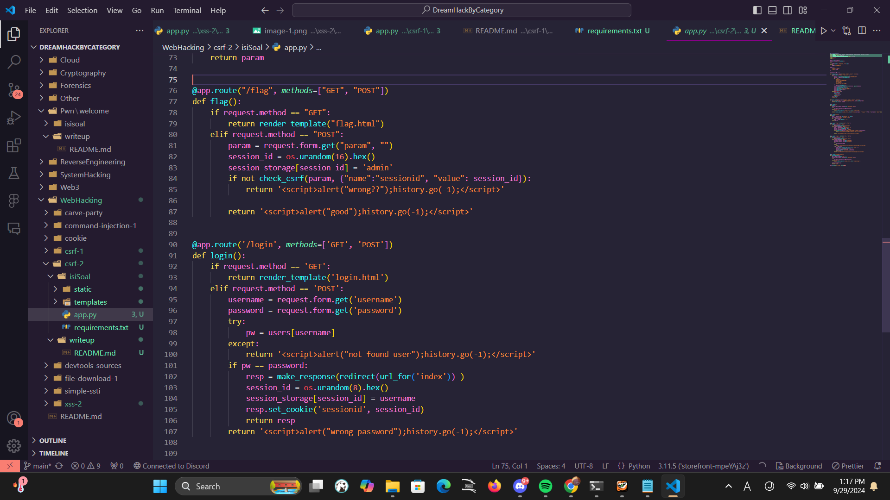
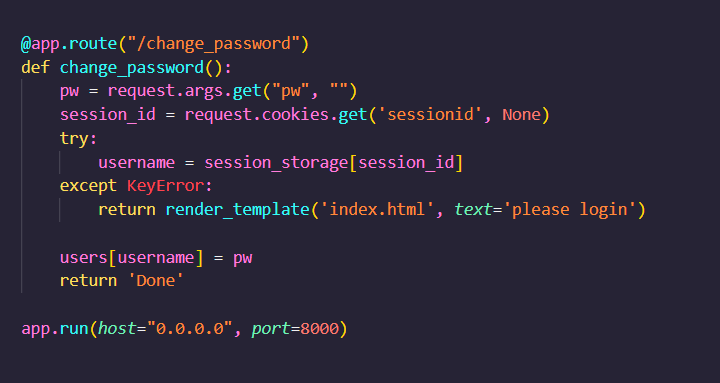
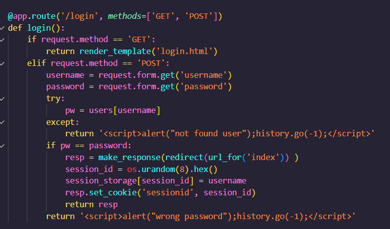

1. /flag bakal set kita sebagai admin sebelum bikin request, nah itu bisa dimanfaatin karena session_id buat admin itu random jadi currently gabisa diketahui secara eksplisit sama sini

2. karena sebelum bikin bikin request sini jadi admin, sini bisa akses /change_password yang itu bisa ganti password dari session_id admin yang diset ama /flag tadi. dari situ bisa bikin argumen pw=password_yang_diinginkan, ex: pw=123, 

3. password admin udah keganti, bisa login pake username admin dan password baru, ntar begitu akses homepage karena kedetect admin jadi dapet flag
