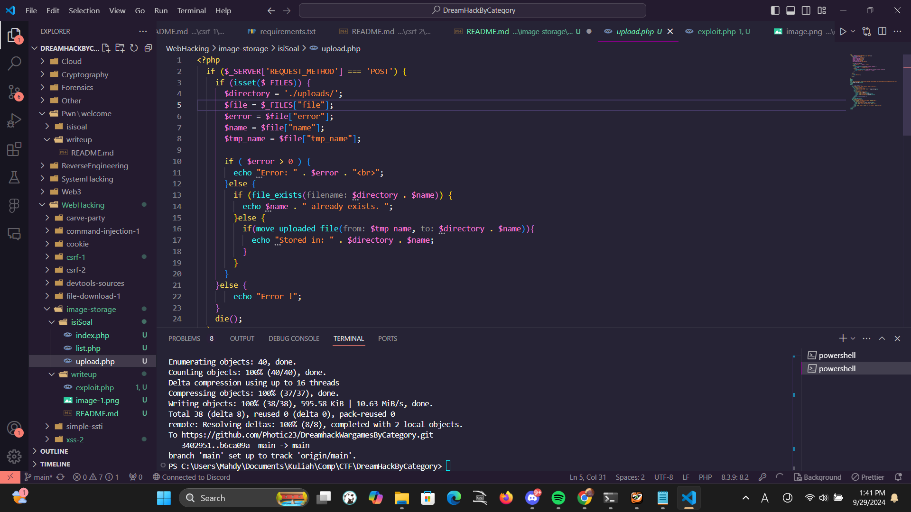
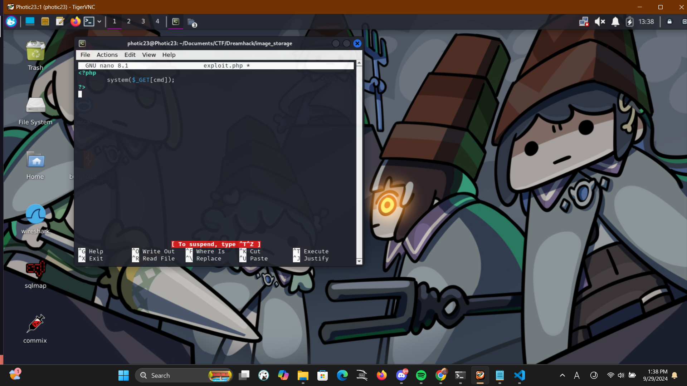
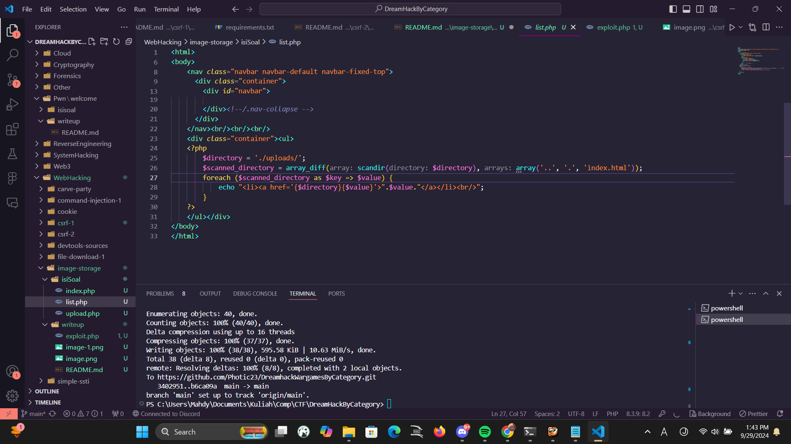

1. upload.php bakal ngeupload file despite apapun extension maupun isinya, so bisa diisi sama file exploit yang dimau, di sini pake explot buat system execute command dari param. yang gw pake system($_GET[cmd]);, ini bakal bikin sistem execute isi dari cmd di param.

2. bisa akses list hasil upload dari list.php dan akses exploit yang udah diupload

3. karena udah bisa execute command dari param cmd, bisa concatenate flag pake cmd=cat /flag.txt
