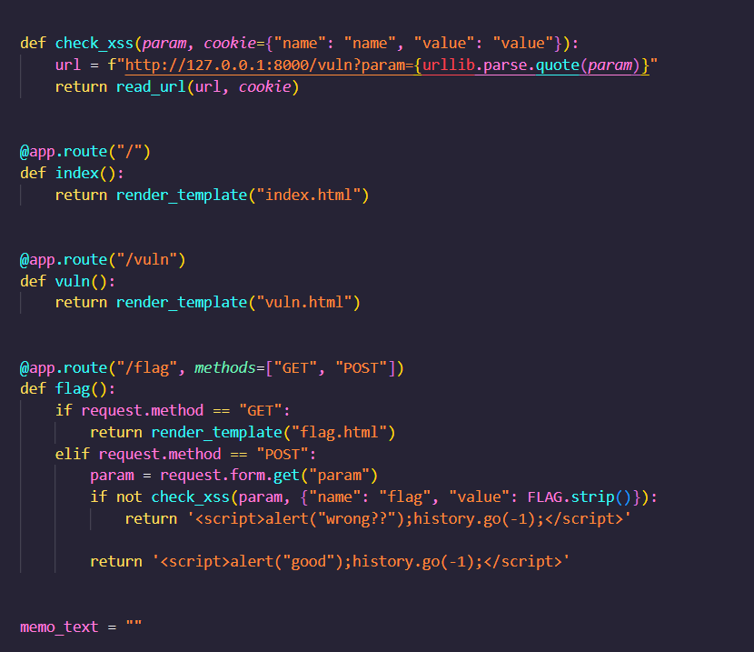
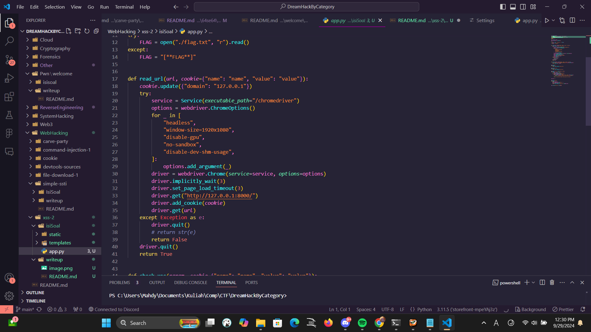
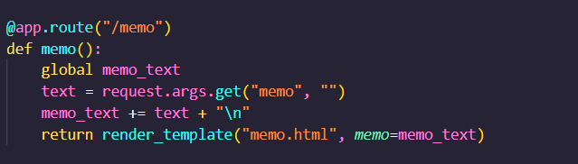

1. Cookie dikeep di machine dari dreamhack, bisa diambil pake xss di post /flag. 

2. Bisa command injection pake <svg onload="location.href= '/memo?memo=' + document.cookie">. bakal ngeakses /memo dengan args memo=document.cookie, itu bakal ngeretrive cookie dan append ke variable global memo

3. flag bisa diakses dari bagian /memo dan udah ada di variable global memo